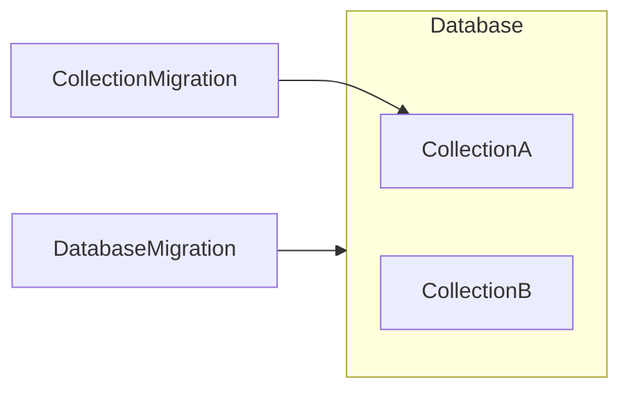
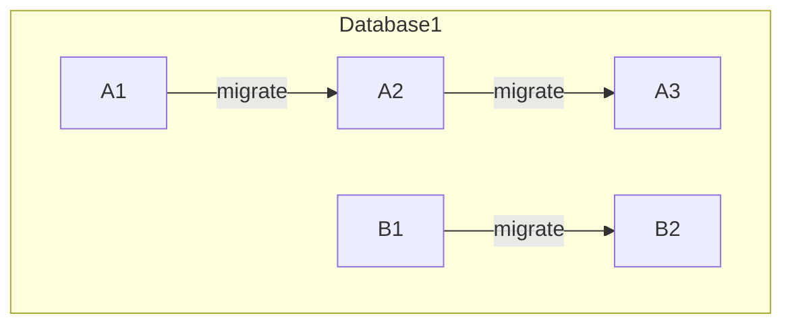
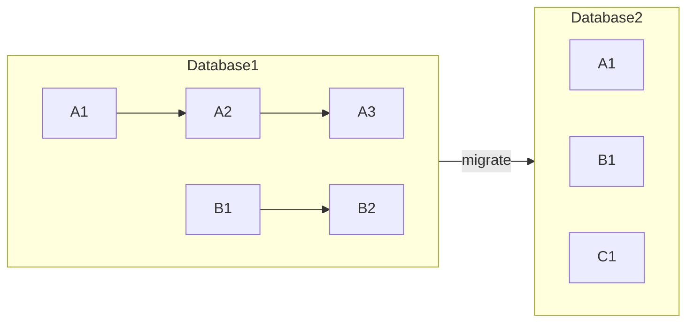

# Database Migration

Impromat consists out of two databases. One on the client side, one on the server side. This is to solve allow an _offline first_ approach for the end-user. However, this also implies a more complex migration strategy.

## Migration on Client Side RxDB

The client uses the [RxDB](https://rxdb.info/) framework which allows offline storage with the possibility of replicating state to the server. RxDB has the concept of _databases_ and _collections_. The framework allows the migration of individual _collections_ out of the box. This works, as long as the change is limited to a single collection, e.g. if a field is renamed. However, if changes get more complex, e.g. when a new collection gets introduced, the migration of individual collections is not sufficient anymore.

Therefore, an application has two migration levels:

1. _collection level_: if fields within a database change, or
2. _database level_: if changes affect multiple collections

The following chart depicts how migrations can either address a single collection or the whole database including all collections:

Hereby the `CollectionMigration` contains specific code for `CollectionA` to migrate from one version to another and `DatabaseMigration` contains specifics for migrating complete `Database`.

To make it more explicit, the following chart describes the versioning of collections, `A` and `B` being collections and their appended numbers the respective version:

The next chart shows how we would version on database level if we would run a `DatabaseMigration`:

Notice, that the version of the Database got increased by 1 and all collections start with an initial version for `Database2`.
