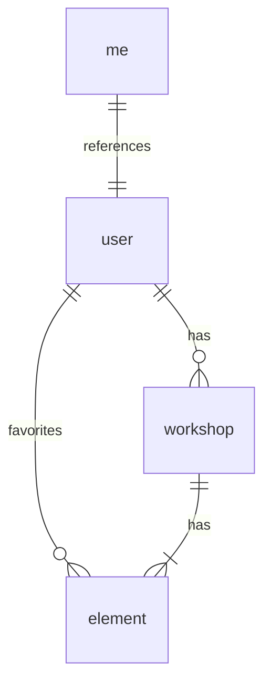
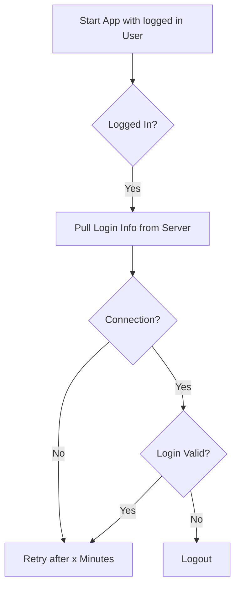

- [Client side Entity Relationships](#client-side-entity-relationships)
  - [Collections](#collections)
  - [Client Authorization](#client-authorization)

# Client side Entity Relationships

The following ER-diagram presents an overview of the client-side collections.

## Collections

- `me`: Contains a single reference to the currently logged in user object.
- `user`: Stores all users the client needs. This might be friends or the own user object.
- `workshop`: Stores improv workshops.
- `element`: Elements might be part of a workshop and represent improv exercises or games.

## Client Authorization

Verify that the user is still logged in.

> TODO add process to logout if there has been no connection for a too long timeframe.
