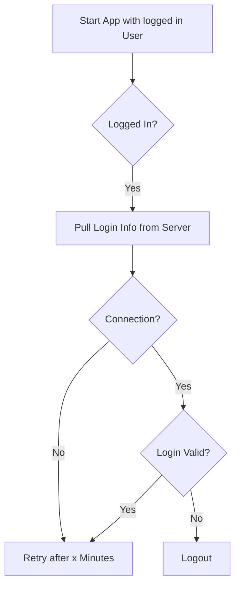

## Client Authorization

Verify that the user is still logged in.

```mermaid
flowchart TD
    S[Start App with logged in User] --> L{Logged In?}
    L -->|Yes| P[Pull Login Info from Server]
    P --> C{Connection?}
    C -->|Yes| V{Login Valid?}
    V -->|Yes| R
    C -->|No| R[Retry after x Minutes]
    V -->|No| O[Logout]
```

> TODO add process to logout if there has been no connection for a too long timeframe.
