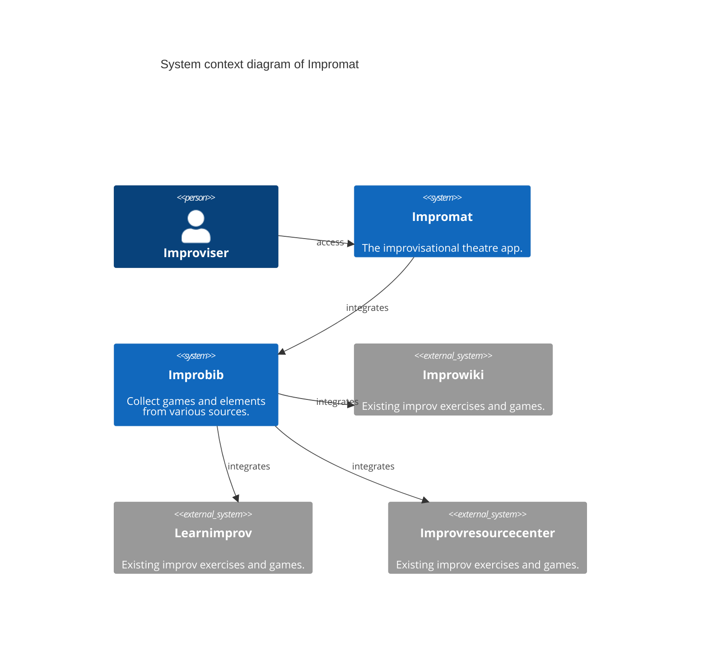
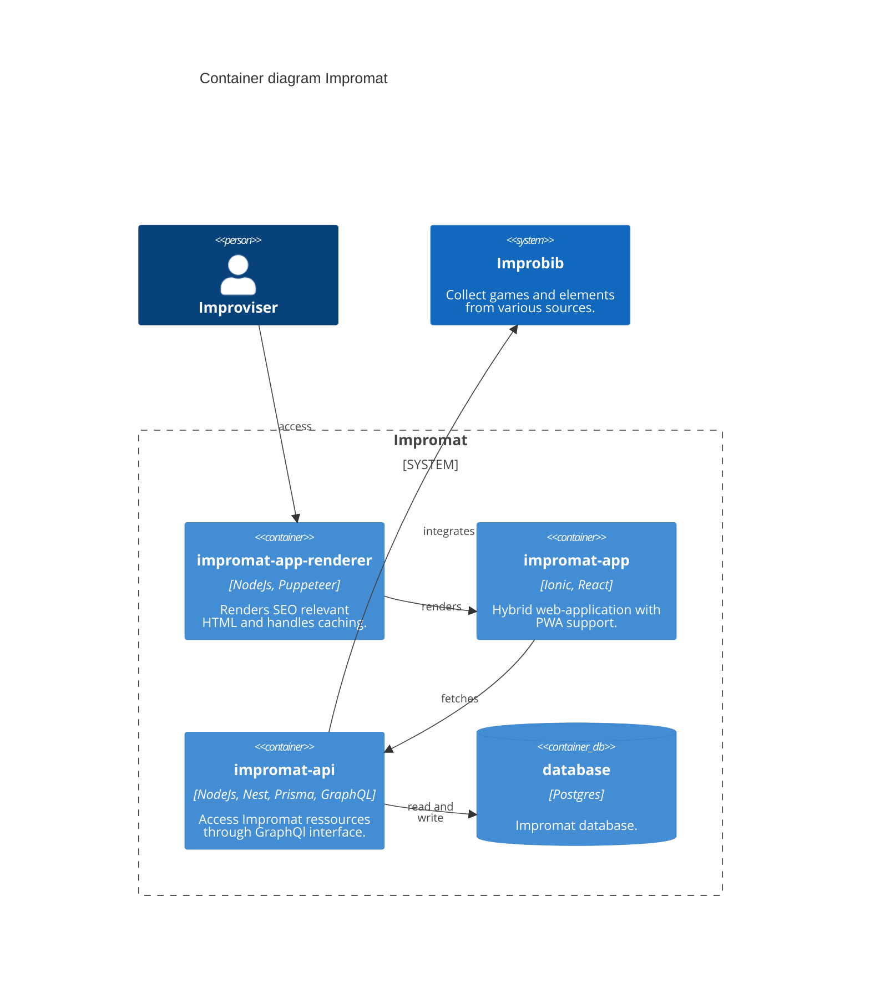
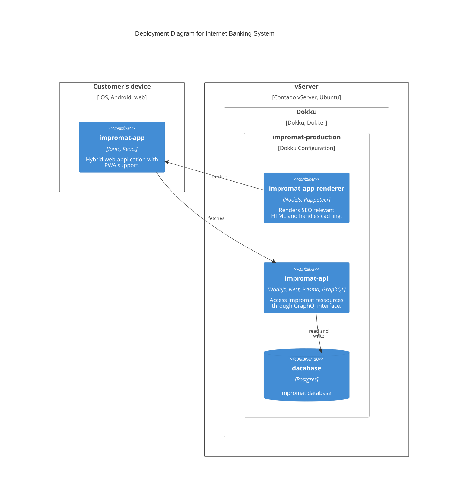

## Context diagram of Impromat

```mermaid
C4Container
  title System context diagram of Impromat

  Person(ImpromatUser, "Improviser")

  System(ImpromatSystem, "Impromat", "The improvisational theatre app.")
  System(ImprobibSystem, "Improbib", "Collect games and elements<br/>from various sources.")

  System_Ext(ImprowikiSystem, "Improwiki", "Existing improv exercises and games.")
  System_Ext(LearnimprovSystem, "Learnimprov", "Existing improv exercises and games.")
  System_Ext(ImprovresourcecenterSystem, "Improvresourcecenter", "Existing improv exercises and games.")


  Rel(ImpromatUser, ImpromatSystem, "access")
  Rel(ImpromatSystem, ImprobibSystem, "integrates")
  Rel(ImprobibSystem, ImprowikiSystem, "integrates")
  Rel(ImprobibSystem, LearnimprovSystem, "integrates")
  Rel(ImprobibSystem, ImprovresourcecenterSystem, "integrates")
```

Zoom into Impromat context to show the `impromat-app-renderer`, `impromat-app` and `impromat-api`:

```mermaid
C4Container
  title Container diagram Impromat

  Person(ImpromatUser, "Improviser")

  System_Boundary(ImpromatSystem, "Impromat") {
    Container(ImpromatRendererContainer, "impromat-app-renderer", "NodeJs, Puppeteer", "Renders SEO relevant<br/>HTML and handles caching.")
    Container(ImpromatAppContainer, "impromat-app", "Ionic, React", "Hybrid web-application with<br/>PWA support.")
    Container(ImpromatApiContainer, "impromat-api", "NodeJs, Nest, Prisma, GraphQL", "Access Impromat ressources<br/>through GraphQl interface.")
    ContainerDb(Database, "database", "Postgres", "Impromat database.")
  }
  System(ImprobibSystem, "Improbib", "Collect games and elements<br/>from various sources.")


  Rel(ImpromatUser, ImpromatRendererContainer, "access")
  Rel(ImpromatRendererContainer, ImpromatAppContainer, "renders")
  UpdateRelStyle(ImpromatRendererContainer, ImpromatAppContainer, $offsetX="-10")
  Rel(ImpromatApiContainer, ImprobibSystem, "integrates")
  Rel(ImpromatAppContainer, ImpromatApiContainer, "fetches")
  UpdateRelStyle(ImpromatAppContainer, ImpromatApiContainer, $offsetX="-20")
  Rel(ImpromatApiContainer, Database, "read and<br/>write")
  UpdateRelStyle(ImpromatApiContainer, Database, $offsetX="-25")
```

### Impromat deployment diagram

```mermaid
C4Deployment
title Deployment Diagram for Internet Banking System


Deployment_Node(mob, "Customer's device", "IOS, Android, web") {
  Container(ImpromatAppContainer, "impromat-app", "Ionic, React", "Hybrid web-application with<br/>PWA support.")
}

Deployment_Node(plc, "vServer", "Contabo vServer, Ubuntu") {
  Deployment_Node(dokku, "Dokku", "Dokku, Dokker") {
    Deployment_Node(impromat-prod, "impromat-production", "Dokku Configuration") {
      Container(ImpromatRendererContainer, "impromat-app-renderer", "NodeJs, Puppeteer", "Renders SEO relevant<br/>HTML and handles caching.")

      Container(ImpromatApiContainer, "impromat-api", "NodeJs, Nest, Prisma, GraphQL", "Access Impromat ressources<br/>through GraphQl interface.")
      ContainerDb(Database, "database", "Postgres", "Impromat database.")
    }
  }
}


  Rel(ImpromatRendererContainer, ImpromatAppContainer, "renders")
  UpdateRelStyle(ImpromatRendererContainer, ImpromatAppContainer, $offsetX="-10")
  Rel(ImpromatAppContainer, ImpromatApiContainer, "fetches")
  UpdateRelStyle(ImpromatAppContainer, ImpromatApiContainer, $offsetX="-20")
  Rel(ImpromatApiContainer, Database, "read and<br/>write")
  UpdateRelStyle(ImpromatApiContainer, Database, $offsetX="-25")

```
