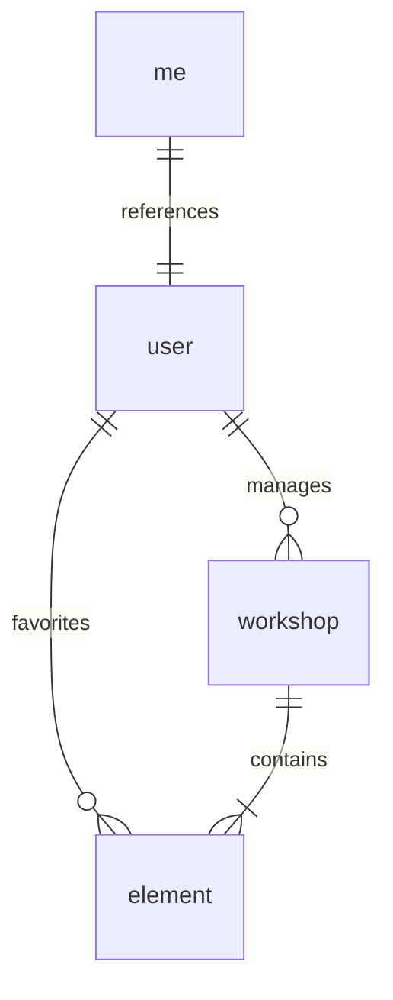
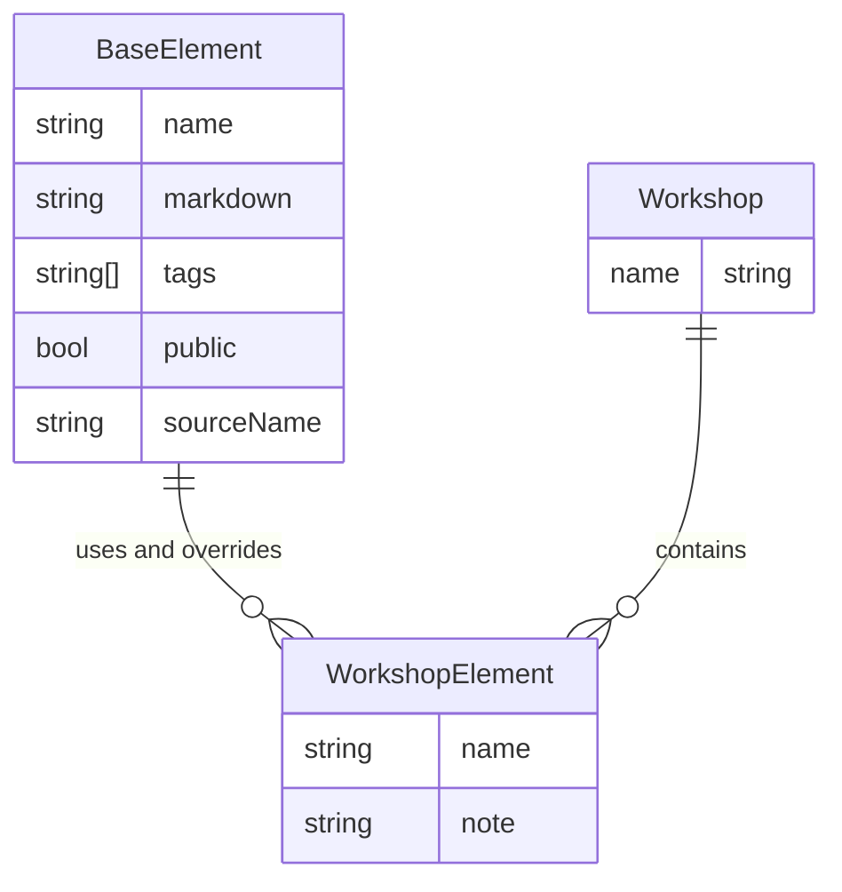
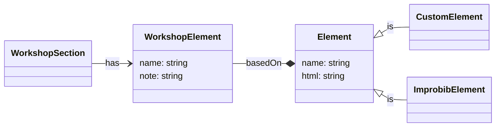

- [Client side Entity Relationships](#client-side-entity-relationships)
  - [ER-Diagram](#er-diagram)
  - [Workshop Elements and Elements](#workshop-elements-and-elements)
  - [Custom Elements](#custom-elements)

# Client side Entity Relationships

## ER-Diagram

The following ER-diagram presents an overview of the client-side collections.

- `me`: Contains a single reference to the currently logged in user object.
- `user`: Stores all users the client needs. This might be friends or the own user object.
- `workshop`: Stores improv workshops.
- `element`: Elements might be part of a workshop and represent improv exercises or games.

## Workshop Elements and Elements

The model holds two types of elements:

1. a **workshop element**, that is an element represented by the workshop. It holds specific information of an element within a workshop, e.g. a note or title.
2. a **base element**, that is either from the Improbib or a custom creation. It holds base information about an element, e.g. description and source information.

## Custom Elements

Users can create their own exercises and games by creating custom elements. Custom elements and elements from the Improbib are the two main sources for workshop elements.

To allow easier reuse of custom elements and to avoid duplications there is always one **Single Source of Truth** element represented by the `basedOn` relationship of the `WorskhopElement`.

The following Domain Model describes the `CustomElement` relationship:

