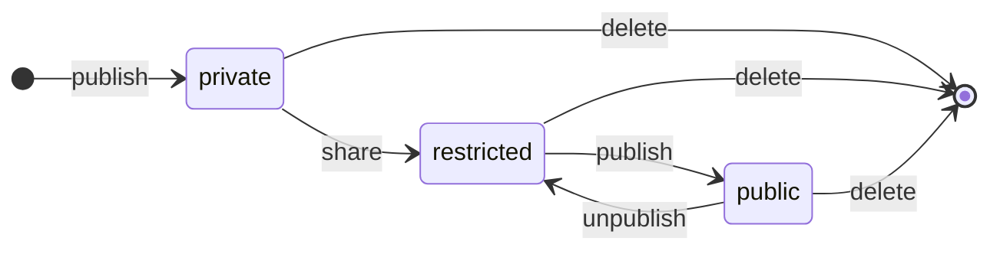

- [Element Sharing](#element-sharing)
  - [Visibility Levels](#visibility-levels)

# Element Sharing

Sharing workshops publicly is one of the core features for Impromat. Thus, a future proof design is inevitable.

## Visibility Levels

Impromat differentiates three different levels of visibility:

- **Public**: shared with the whole community, accessible by everyone on the internet.
- **Restricted**: limited access to selected members or users that hold a shared url.
- **Private**: only the author has access to the resource.

**Element Sharing State**

