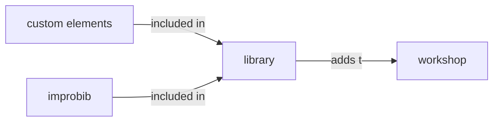
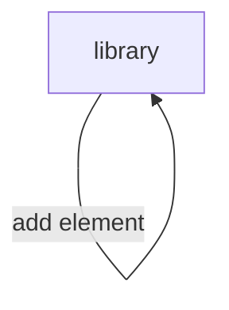
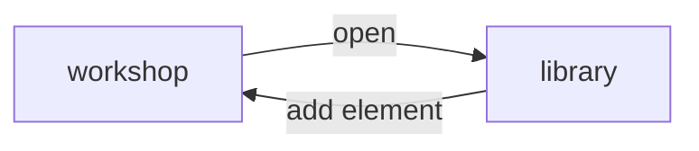

- [Library](#library)
  - [Custom Elements and Improbib](#custom-elements-and-improbib)
  - [Standalone and Workshop Context](#standalone-and-workshop-context)
  - [Navigation Flow](#navigation-flow)

# Library

The following sections describe the library feature.

## Custom Elements and Improbib

The library contains all elements that a workshop can access.

## Standalone and Workshop Context

The library deals with two different use cases:

1. Standalone library to browse and manage existing elements
2. Workshop context to add an element from the library to a workshop

Main differentiator between both approaches is the _workshop context_. Either, the library was opened from a workshop in order to add elements to the workshop. Or, the library was opened through the main menu, without specifying any workshop in particular. The latter one is a **standalone library** and the other one a **library with workshop context**.

## Navigation Flow

On actions, the **standalone** library always navigates back to the library.

If the library was opened from a workshop (e.g. with a workshop context), actions trigger a navigation back to the original workshop.

