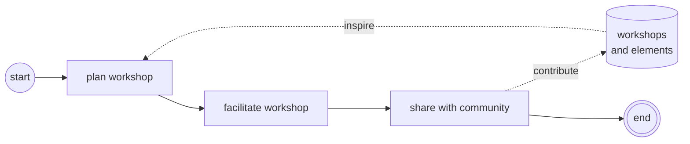

# Roadmap

## Version 1 - Enabling Individual Workshops

Impromat must effectively support facilitators with the creation of improvisational theatre workshops.

**Flow from facilitation view**

## Creating a workshop (0.60.0)

- Task: Create a workshop about "Group mind focused elements with dancing and focus on the complete ensemble. Beginner friendly."

- Workshop Creation Flow:

  - Go to workshop page
  - Click on "+" button in bottom right corner.
  - Choose workshop name
  - Add description by clicking on menu button in top right corner

  - Click on bottom right to search elements
    - It is not very apparent, that you can add elements from here. Possible to make this more apparent?
    - Forwarded to a different page which is weird (would expect a dedicated page)
  - Searching for "Group"
    - Possible to make this "automatic" e.g. select tags in the workshop already to get relevant elements?
  - Then, I am opening up Group Stop.
    - Make "add to workshop" more apparent.
  - Clicking on bottom right button to add to a workshop. Have to select the "correct" workshop again.
    - Possible to retain context?
  - Switch to workshop page again. Have to click on bottom right button.
  - Searching for "warmup Group", trying to find warmup exercises
    - It is not possible to only find warmup exercises :(
