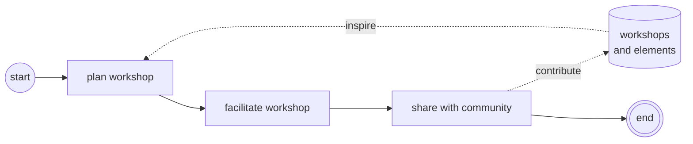

# Roadmap

## Version 1 - Enabling Individual Workshops

Impromat must effectively support facilitators with the creation of improvisational theatre workshops.

**Flow from facilitation view**

```mermaid
flowchart LR
    start((start))-->plan[plan workshop]
    elements-.->|inspire|plan
    plan-->facilitate[facilitate workshop]
    facilitate-->share[share with community]
    share-.->|contribute|elements[(workshops\nand elements)]
    share-->stop(((end)))
```
