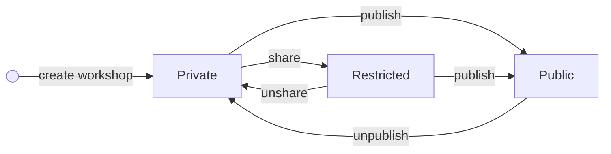
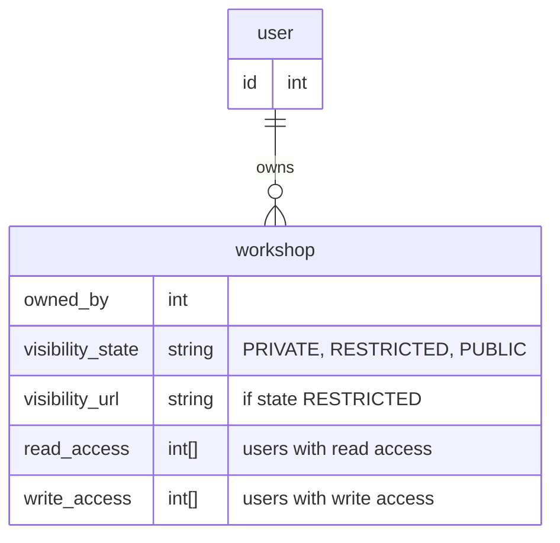

- [Workshop Sharing](#workshop-sharing)
  - [Visibility Levels](#visibility-levels)
  - [Access Levels](#access-levels)
  - [Data Model](#data-model)

# Workshop Sharing

Sharing workshops publicly is one of the core features for Impromat. Thus, a future proof design is inevitable.

## Visibility Levels

Impromat differentiates three different levels of visibility:

- **Public**: shared with the whole community, accessible by everyone on the internet.
- **Restricted**: limited access to selected members or users that hold a shared url.
- **Private**: only the author has access to the resource.

**Workshop Visibility States**

## Access Levels

The application differentiates three access levels:

- **Reader**: can see a workshop and all associated elements.
- **Writer**: can change a workshop and all associated elements.

## Data Model

> TODO: are `read_access` and `write_access` protected variables that are not synced to all clients? Could also put `visibility...` into own collection.
