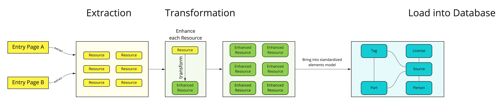

# Improbib

Collecting and merging improvisational exercises and games from various sources.

## Getting started

## Architecture

The download always begins on an _entry page_. This is a special page in the wiki that references all meaningful parts.

All urls that the _entry page_ contains are processed by subsequent _page processors_. A page processor is called for each page and if it is valid it's processing code is evaluated against that page.

## Markdown parsing

See https://github.com/syntax-tree/mdast for the Markdown syntax tree.

## Data Model

The data model has three main types:

- `Entry`
- `Element`
- `Tag`

`Element` is an workshop element like an exercise, game, or warm-up.

`Tag` is a label for an `Element` they can be anything that helps categorizing the `Element`.

If you refer the either a `Tag` or an `Element` you would call it `Entry`.

# FAQ

## Copyright

License information are attached to individual games and exercises. Please follow [guidelines and best practices for attribution](https://wiki.creativecommons.org/wiki/Best_practices_for_attribution#This_is_an_ideal_attribution).

## Motivation

I am an improviser by myself. I love it. And with growing experience I was running more and more improv workshops and even established my own group. Often I would go to https://improwiki.com or similar sites to look for new workshop inspirations. Then I also started teaching others how to run improv workshops and a colleague of mine pointed me to a "Retromat", where you can create retrospectives with the click of a button. Well, through these events I came up with the idea of programming an Impromat, to help me with preparing workshops and to share my workshop knowledge with other improvisers and other groups.
