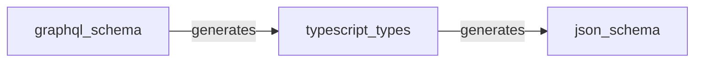

## Schema generation

The GraphQL schema is the master schema.

### Impromat Schema

RxDB throws a `RxError (DB6)` error if the schema is modified on frontend. Thus, if the generated schema gets pushed to frontend the app will always crash until a proper migration strategy is in place.
