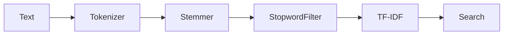

# Setup of document search

- [Natural](https://github.com/NaturalNode/natural)



## Word Tokenization, Stop Word Removal and Stemming

The following is a result of tokenization, stop word removal and stemming of _Tod in einer Minute_:

```js
  'spiel',        'spiel',      'beteiligt',
  'lass',         'belieb',     'vorgab',
  'spiel',        'normal',     'szen',
  'aufgab',       'innerhalb',  'minut',
  'sterb',        'uberleb',    'spielt',
  'solo',         'moderator',  'szen',
  'beendet',      'spiel',      'gleich',
  'nam',          'spiel',      'gleich',
  'nam',          'variant',    'spiel',
  'halbwertzeit', 'spiel',      'beginn',
  'szen',         'evtl',       'vorgab',
  'publikum',     'innerhalb',  'minut',
  'figur',        'sterb',      'selb',
  'szen',         'wiederholt', 'halb',
  'minut',        'gespielt',   '15',
  'sekund',       '8',          '4',
  '2',            '1',          'sekund',
```

## Performance of the `AggressiveTokenizerDe` is much better than the `WordTokenizer`

The `WordTokenizer` wraps words in German that should not be stemmed. Thus, the text should always be tested and the according language tokenizer should be used.

Original Text of _Tod in einer Minute_:

```markdown
An diesem Spiel sind zwei Spieler beteiligt. Sie lassen sich eine beliebige Vorgabe. Sie spielen eine normale Szene. Aufgabe ist, dass einer von beiden innerhalb einer Minute sterben muss. Der Überlebende spielt Solo, bis der Moderator die Szene beendet.

Anderes Spiel, gleicher Name

Außerdem gibt es ein Spiel unter dem gleichen Namen als Variante des Spiels Halbwertzeit:

Zwei Spieler beginnen eine Szene (evtl. mit Vorgaben des Publikums) bei der innerhalb einer Minute eine der beiden Figuren sterben muss. Nun wird die selbe Szene wiederholt, jedoch wird jetzt nur noch eine halbe Minute gespielt. Dann 15 Sekunden, 8, 4, 2, 1 Sekunden.
```

For example, see the result of `Außerdem`

`AggressiveTokenizerDe`:

```js
  'An',         'diesem',       'Spiel',    'sind',       'zwei',
  'Spieler',    'beteiligt',    'Sie',      'lassen',     'sich',
  'eine',       'beliebige',    'Vorgabe',  'Sie',        'spielen',
  'eine',       'normale',      'Szene',    'Aufgabe',    'ist',
  'dass',       'einer',        'von',      'beiden',     'innerhalb',
  'einer',      'Minute',       'sterben',  'muss',       'Der',
  'berlebende', 'spielt',       'Solo',     'bis',        'der',
  'Moderator',  'die',          'Szene',    'beendet',    'Anderes',
  'Spiel',      'gleicher',     'Name',     'Außerdem',   'gibt',
  // ...
```

`WordTokenizer`:

```js
  'An',         'diesem',    'Spiel',        'sind',     'zwei',
  'Spieler',    'beteiligt', 'Sie',          'lassen',   'sich',
  'eine',       'beliebige', 'Vorgabe',      'Sie',      'spielen',
  'eine',       'normale',   'Szene',        'Aufgabe',  'ist',
  'dass',       'einer',     'von',          'beiden',   'innerhalb',
  'einer',      'Minute',    'sterben',      'muss',     'Der',
  'berlebende', 'spielt',    'Solo',         'bis',      'der',
  'Moderator',  'die',       'Szene',        'beendet',  'Anderes',
  'Spiel',      'gleicher',  'Name',         'Au',       'erdem',
  // ...
```
